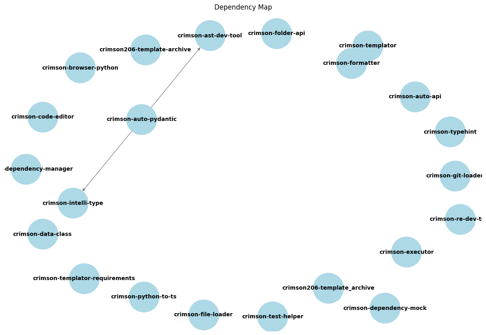
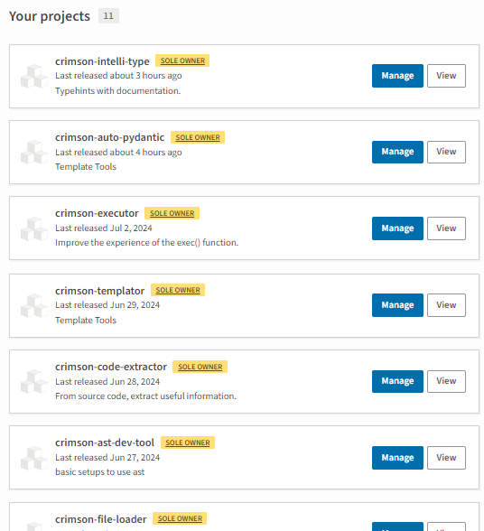
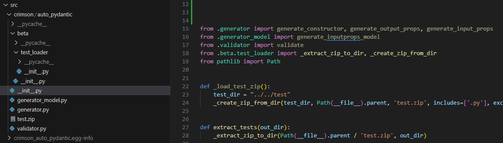
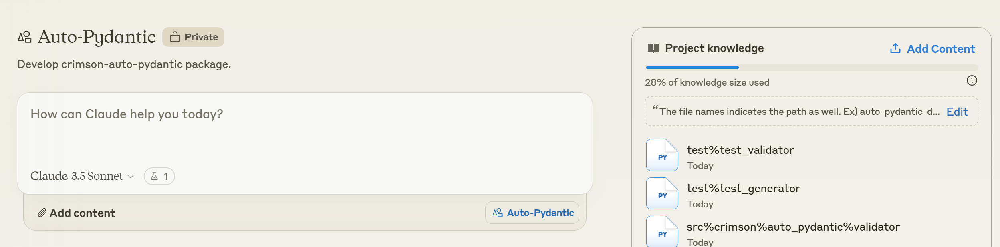

# MicroWise Development

MicroWise Development is an approach where you develop your packages using 4-10 scripts in `dedicated repositories`. Currently, this is a non-code repository concept.

To check the framework establish progress, check the [orchestration](https://github.com/crimson206/micro-wise-development/blob/main/orchestration.md)

## Visualization
See how many modules I have published or am developing. They are all developed in their own repositories.\

------------------------------ Omitted -------------------------------

## Advantages

- **Extreme Dependency Freedom**: 
    Develop your packages as general-purpose tools, avoiding overly specific features for your other packages. This approach ensures that all your packages can remain free from dependencies.

- **Easy to Initiate, Easy to Abandon**: 
    Unlike modules in a large package, individual modules in micro packages are not as critical. Feel free to experiment with new ideas, and delete them if they don't work out, without significant consequences.

- **Dedicated Version Control**: 
    In a large package with multiple modules, you need to create a pull request for any update, making it difficult to track changes across versions. With MicroWise Development, you only need to update the repository of target modules, simplifying version control.

- **Learn Development Process**: 
    MicroWise Development involves frequently creating new repositories. This process encourages regular setup and publication of small packages. The small scale allows for more experimentation with less risk, making it an ideal environment for implementing CI/CD through trial and error.

- **Clean Repository Management**: 
    Large packages can be challenging to review in their entirety. In MicroWise development, you can refactor any package within an hour, keeping your repositories clean and manageable.

- **AI-Assisted Development**: 
    While autonomous agents may struggle with large projects, they are well-suited for smaller, focused tasks. MicroWise Development aligns with the strengths of current AI technologies, potentially paving the way for more effective AI-assisted programming in the future.

## Challenges

- **Dependency Control**: 
    Dependency is a double-edged sword in MicroWise Development. While individual packages can enjoy a dependency-free environment, the packages often rely on each other. The packages themselves shouldn't need to consider others, but as a developer, you must manage these interdependencies.

- **Namespace Management**: 
    Smaller packages lead to more namespaces, making it challenging to name your packages consistently. In MicroWise Development, this can become a daily task. Using a common namespace (like 'crimson' in this example) serves two purposes:
        - It respects the shared development environment by preventing namespace pollution.
        - It adds a layer of accountability by associating packages with your GitHub ID.

## Work in Progress

- **Dependency Manager**: 
    This tool will collect information about your distributed packages and create a dependency map, helping manage inter-package relationships.

- **Unittest Helper**: 
    While achieving high test coverage is easier with smaller packages, MicroWise Development requires testing the impact of updates across dependent packages. This tool will facilitate running tests with both previous and new versions of a package, ensuring compatibility across your ecosystem.

- **Automation**: 
    Currently using a template repository for consistent development environments, there's a need for a more dynamic solution. A development environment manager is under consideration to keep all packages up-to-date with the latest best practices and tools.

- **More...**

## Examples

### Template

A repository template is used to maintain consistent development environments across packages. The goal is to make this template a modular, adaptable tool.

- [Template](https://github.com/crimson206/template)

#### Templator

The 'template' repository was created using the following modules. While there are plans to transition to 'jinja2', these tools remain useful for their simplicity. Even if some of your modules are of lower quality, they are isolated and don't affect your other packages. Keep them without any burden.

- [Templator](https://github.com/crimson206/templator)
- [Formatter](https://github.com/crimson206/formatter)
- [Usage Example](https://github.com/crimson206/template/blob/main/generate_toml.py)

### Clean Code Tools

- [IntelliyType](https://github.com/crimson206/intelli-type)
    - Allows writing typehints with docstrings, enhancing code clarity.
- [AutoPydantic](https://github.com/crimson206/auto-pydantic)
    - Automatically generates Pydantic BaseModels for function input and output annotations.
    - Provides a 'validate' function to ensure functions receive the expected input types.

### Beta

It is just an example.

I need to develop the 'test-loader' module so that I can automate

- all the modules' publishing with tests as well
- add extract_texts function to all modules

My 'auto-pydantic' module is obviously not a module for the unittest, but it will expose some functions from 'test-loader'.
I wanted to implement it when I was updating 'auto-pydantic' module.

- develop test-loader in 'beta' directory first if you want. Users are not recommended to use the functions from 'beta'.
- you move the 'test-loader' module to a new repository 'test-loader', and replace the one in beta with the newly published 'test-loader'.

### Programming with AI

I uploaded all the useful files from [AutoPydantic](https://github.com/crimson206/auto-pydantic) repository.

- src/
- test/
- pytest coverage htmls
- pyproject.toml
- auto-pydantic-dev/

The scope of the contents is limited so that AI is not confused and can help you with large parts of your entire module.

### More...